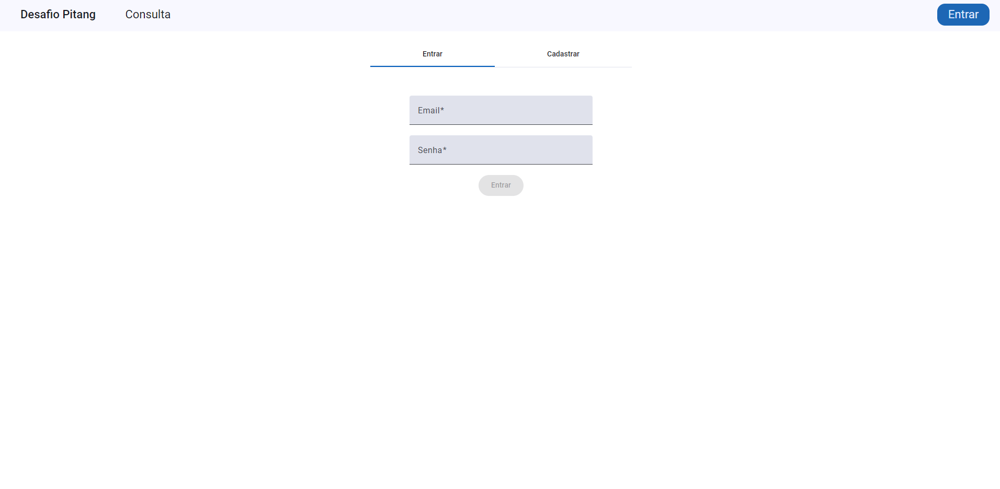
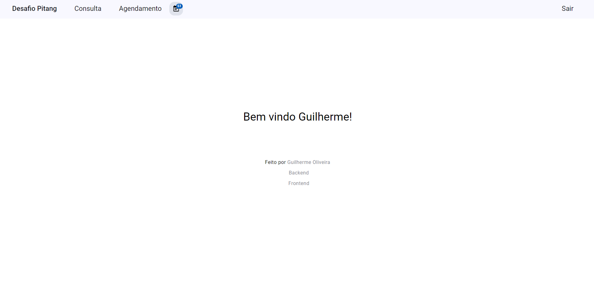
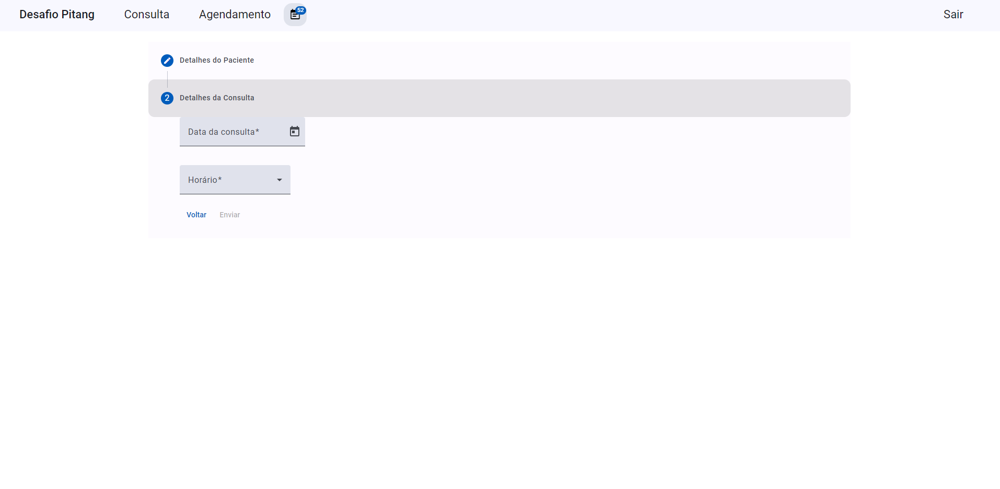
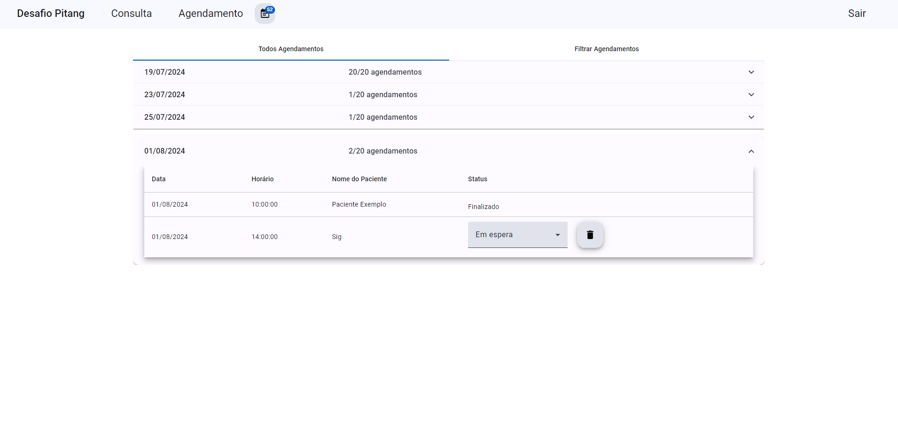

# Desafio Pitang Frontend

## Descrição

O **Desafio Pitang Frontend** é o frontend de um sistema que desenvolvi para o desafio final do programa de estágio da Pitang. O sistema permite criar, consultar, atualizar e excluir agendamentos, além de autenticar usuários e registrar novos usuários.

## Funções de destaque:

- Design consistente com o Angular Material e o uso de SCSS.
- Responsabilidades bem divididas graças a arquitetura robusta do projeto.
- Validações nos campos que o usuário precisa preencher algum dado, para guia-lo e evitar erros.
- Validações customizadas para atender as regras de negócio do projeto.
- Notificações com Modais para chamar a atenção do usuário, e Snackbars para notificações mais simples.
- Login com Token JWT e Refresh Token com os interceptors.
- **Diferentes niveis de autênticação**, um usuário comum pode apenas alterar seus registros, um administrador pode alterar todos.
- Responsabilidades bem divididas graças a arquitetura robusta do projeto.
- Uso dos **Observables** para evitar chamadas desnecessárias a API.
- Agendamentos organizados por dia e horário.
- Uso do padrão [Conventional Commits](https://www.conventionalcommits.org/pt-br/v1.0.0-beta.4/) em conjunto com [Git Flow](https://dev.to/gabrielduete/gitflow-4dok) para uma melhor organização de Repositório.
- Funções adicionais para melhorar a experiência do usuário (ver agendamentos feitos pelo usuário e filtrar agendamentos por data).

# Como Rodar o Projeto

## Pré-requisitos

Antes de começar, certifique-se de que você tem os seguintes itens instalados:

- Node
- CLI do Angular

## Configuração do Frontend

### **[Atenção]** É necessário que você rode o backend para poder desfrutar do sistema. [aqui](https://github.com/GuilOliveira/Desafio-Pitang-Backend) você encontra como o fazer.

### 1. Clonar o Repositório

Clone o repositório:

```bash
git clone https://github.com/GuilOliveira/Desafio-Pitang-Frontend.git
cd Desafio-Pitang-Frontend
```

### 2. Instalar as dependências

Instale as dependências do projeto com:

```bash
npm install
```

### 3. Atualizar o proxy

Mude o endereço que está em _src/proxy.conf.json_ para o endereço da sua api:

```json
{
	"/api": {
		"target": "https://[ENDEREÇO DA SUA API]",
		"secure": false,
		"changeOrigin": true,
		"logLevel": "debug"
	}
}
```

### 4. Executar o Projeto

- A melhor parte! Inicie o servidor de desenvolvimento com:

```bash
ng serve
```

# Imagens do sistema

- Página de login



- Página home



- Página de cadastro de agendamentos



- Página de visualização agendamentos



# Requisitos do Sistema

| Requisito                                                                                                                                                                                                              | Tipo             | UI  | Usável | Totalmente Concluído / Validado |
| ---------------------------------------------------------------------------------------------------------------------------------------------------------------------------------------------------------------------- | ---------------- | --- | ------ | ------------------------------- |
| O agendamento deve ser feito em uma página por um formulário.                                                                                                                                                          | Regra de uso     | Yes | Yes    | Yes                             |
| A disponibilidade das vagas são de 20 por dia.                                                                                                                                                                         | Regra de uso     | Yes | Yes    | Yes                             |
| Cada horário só tem a disponibilidade de 2 agendamentos para o mesmo horário.                                                                                                                                          | Regra de uso     | Yes | Yes    | Yes                             |
| Deve ser criada uma página para consultar os agendamentos.                                                                                                                                                             | Regra de uso     | Yes | Yes    | Yes                             |
| O resultado dos agendamentos deve ser agrupado por dia e hora do agendamento.                                                                                                                                          | Regra de uso     | Yes | Yes    | Yes                             |
| O intervalo de tempo entre um agendamento e outro é de 1 hora.                                                                                                                                                         | Regra de uso     | Yes | Yes    | Yes                             |
| O paciente deve informar seu nome, data de nascimento e dia e horário para o agendamento.                                                                                                                              | Regra de negócio | Yes | Yes    | Yes                             |
| Deverá ser checado se o formulário foi preenchido.                                                                                                                                                                     | Regra de negócio | Yes | Yes    | Yes                             |
| Os dados do paciente/agendamentos devem ser armazenados em memória e dentro de um BehaviorSubject.                                                                                                                     | Regra de negócio | Yes | Yes    | Yes                             |
| Exibir mensagem de agendamento criado com sucesso dentro de um modal/popup, usando um service para controlar o estado do modal.                                                                                        | Regra de negócio | Yes | Yes    | Yes                             |
| Dentro da página para consultar os agendamentos deve ser possível visualizar a listagem de agendamentos feitos e informar se o agendamento foi realizado ou não, e qual a conclusão do atendimento (se foi realizado). | Regra de negócio | Yes | Yes    | Yes                             |
| Quando o usuário der F5 ou recarregar a página os dados não podem ser perdidos, devem ser salvadas no localStorage.                                                                                                    | Regra de negócio | Yes | Yes    | Yes                             |
| Criar um ícone de notificação que será responsável por mostrar a quantidade de agendamentos do usuário e deverá ser atualizado sempre que um novo agendamento for realizado.                                           | Regra de negócio | Yes | Yes    | Yes                             |

# Regras projeto

- [x] Uso de observables no Angular.
- [x] Utilizar DatePicker do Angular Material.
- [x] Evitar any no typescript.
- [x] Usar Pipe para tratamento de datas.
- [x] Separar responsabilidades de Template, Componente e Services.
- [x] Implementar componente de Loading nas chamadas a API.
- [x] Banco de dados: SQL Server Express
- [x] Versão dotnet core: 6
- [x] Versão do angular: 17 ou 18
- [x] Implementar os controllers que disponibilizam as APIs para o
      frontend.
- [x] Criar endpoints para criar, ler, atualizar e deletar (CRUD).
- [x] Criar as interfaces de todos os serviços de negócios.
- [x] Implementar as regras de negócio necessárias.
- [x] Criar as entidades de negócio, bem como os DTOs e Models
      necessários para a aplicação.
- [x] Criar as validações de negócio para garantir a integridade dos
      dados.
- [x] Utilizar o fluentvalidation ou realizar validações “manuais”.
- [x] Criar as interfaces de todos os repositórios.
- [x] Mapear as entidades para o banco de dados utilizando Entity
- [x] Implementar os repositórios e suas consultas.
- [x] Não utilizar migrations.
- [x] Implementação de testes unitários em sua respectiva camada

## Critérios de destaque:

- [x] Implementar testes unitários com banco de dados em memória.
- [x] Autenticação JWT.
- [x] Controle de transação.
- [x] Criar validação customizada.

## Critérios de avaliação:

Organização do código.

Utilização dos princípios do SOLID.

• Organização dos commits.

o Commits por features, utilizando os princípios do gitflow.

• Organização do repositório.

o Criação de um repositório para Front e outro Back-end.

• Seguir todas as regras estabelecidas.
